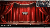

# 🎵 브레멘 음악대 (The Bremen Town Musicians)

> 6대의 OV7670 카메라와 다중 FPGA를 이용한 **실시간 비전 연주 시스템**  
> 대한상공회의소 서울기술교육센터 | 2026.07.01 ~ 2026.07.21

<br>

## 📌 프로젝트 개요

**브레멘 음악대**는 6대의 OV7670 카메라 영상을 Master·Slave FPGA 구조로 실시간 처리하고, 영상 속 특정 색상 객체의 위치를 음계 데이터로 변환하여 연주하는 6인 팀 프로젝트입니다.

5대의 Slave FPGA에서 처리한 영상은 SPI를 통해 Master FPGA로 전달되고, Master에서는 자체 영상과 Slave 영상을 합쳐 **2×3 VGA 모자이크 화면**을 구성합니다. 음계 데이터는 별도의 통신 경로를 통해 수집되어 PC의 연주 프로그램과 연동됩니다.

<p align="center">
  
</p>

<p align="center">
  <b>브레멘 음악대 전체 시스템 구성</b>
</p>

> **이 README는 팀 전체 기능 중 제가 담당한 `Ping-Pong Buffer 기반 영상 메모리 제어`를 중심으로 정리했습니다.**  
> 영상 압축, I2C·UART 통신, 객체 인식, Master 화면 통합 등은 전체 시스템 구성 요소로만 소개하고 상세 구현 설명은 생략했습니다.

<br>

## 👥 프로젝트 형태 및 역할

**6인 팀 프로젝트**

| 이름 | 담당 역할 |
| :---: | --- |
| 이준형 | Master Integration 및 전체 시스템 아키텍처 |
| 곽은찬 | Python 영상·오디오 UI 및 UART 연동 |
| 안정현 | I2C Master/Slave 통신 설계 |
| 윤지원 | YCoCg 영상 압축·복원 |
| **최여지** | **Ping-Pong Buffer 기반 메모리 컨트롤러 및 동기화 설계** |
| 최은수 | Slave Integration 및 OV7670·객체 인식 |

<br>

## 🙋 담당 역할

### Ping-Pong Buffer 기반 영상 메모리 제어

- Slave FPGA의 영상 Frame Buffer 제어 구조 설계
- Memory A/B를 번갈아 사용하는 Ping-Pong Buffer 구현
- 한 메모리에 영상을 저장하는 동안 다른 메모리의 데이터를 SPI 전송에 사용하도록 Read/Write 경로 분리
- `frame_done`과 전송 상태를 기준으로 Buffer 전환 시점 제어
- SPI 전송 중인 메모리에 새로운 영상이 덮어써지지 않도록 제어
- 프레임 단위 Buffer 전환과 실제 영상 전송 동작 확인

<br>

## 🛠 사용 기술

| 구분 | 사용 기술 |
| --- | --- |
| HDL / FPGA | SystemVerilog, Digilent Basys 3, Xilinx Artix-7, Vivado |
| Camera | OV7670 |
| Memory | Frame Buffer, Ping-Pong Double Buffering |
| Communication | SPI 연동 |

<br>

# 💾 Ping-Pong Buffer 기반 영상 메모리 제어

## 1. Memory A/B 분리

카메라 영상 저장과 SPI 전송이 같은 메모리에 동시에 접근하면, 전송 중인 Frame이 새로운 영상으로 덮어써질 수 있습니다.

이를 방지하기 위해 두 개의 영상 메모리를 두고 **Write Buffer와 Read Buffer가 항상 서로 다른 메모리를 사용하도록** 구성했습니다.

```text
Frame N
Camera Write  → Memory A
SPI Read      → Memory B

Buffer Swap

Frame N+1
Camera Write  → Memory B
SPI Read      → Memory A
```

현재 Write 대상이 `Memory A`라면 SPI는 `Memory B`를 읽고, Write 대상이 `Memory B`라면 SPI는 `Memory A`를 읽도록 선택 구조를 구성했습니다.

<br>

## 2. Frame 단위 Buffer 전환

Buffer는 영상 저장 도중 임의로 전환하지 않고 **한 Frame의 저장이 완료된 시점**을 기준으로 전환하도록 했습니다.

```text
Camera Frame 저장
       ↓
frame_done 확인
       ↓
SPI 전송 상태 확인
       ↓
전송 중이 아니면 Buffer Swap
       ↓
frame_ready = 1
```

`frame_done`이 발생하고 SPI 전송이 진행 중이지 않을 때만 Write Buffer를 변경하여, 완성되지 않은 Frame이 전송되는 것을 방지했습니다.

<br>

## 3. SPI 전송 중 덮어쓰기 방지

영상 전송 상태는 `sending`과 `sender_busy`를 이용해 확인하고, 둘 중 하나라도 활성화되어 있으면 Buffer 전환을 대기하도록 구성했습니다.

```text
SPI 전송 중
sending | sender_busy = 1
       ↓
Buffer 유지
       ↓
전송 완료
       ↓
다음 Frame에서 Buffer 전환 가능
```

전송이 완료되면 `tx_done`을 기준으로 `frame_ready` 상태를 해제하여 다음 Frame 저장·전송 흐름으로 이어지도록 했습니다.

<br>

# ⚠️ 문제 해결

## 영상 저장과 SPI 전송 간 메모리 충돌

### 문제

영상 저장과 SPI 전송이 동일한 메모리를 동시에 사용할 경우, 전송 중인 Frame 데이터가 새로운 카메라 영상으로 덮어써져 화면 깨짐이나 불완전한 Frame 전송이 발생할 수 있었습니다.

### 해결

- Memory A/B를 사용하는 Ping-Pong Buffer 구조 적용
- Write Buffer와 SPI Read Buffer를 서로 반대로 선택
- `frame_done` 이후에만 Buffer 전환
- SPI 전송 중에는 Buffer 전환을 보류
- 전송 완료 후 다음 Frame 처리 상태로 복귀

### 결과

영상 저장과 SPI 전송의 메모리 접근을 분리하여 프레임 단위로 안정적인 영상 데이터 전달이 이루어지는 것을 확인했습니다.

<br>

# 🧪 검증 및 결과

담당한 영상 메모리 제어 구간을 중심으로 다음 동작을 확인했습니다.

- 카메라 영상 저장 시 Write Address 증가 확인
- Memory A/B가 Frame 단위로 교차 선택되는지 확인
- `frame_done` 발생 이후 Buffer가 전환되는지 확인
- SPI 전송 중 Buffer가 유지되는지 확인
- 전송 중인 메모리에 새로운 영상이 덮어써지지 않는지 확인
- 최종적으로 다중 FPGA 영상이 2×3 VGA 화면에 정상적으로 통합되는지 확인

<p align="center">
  
</p>

<p align="center">
  <b>다중 FPGA 2×3 VGA 영상 통합 결과</b>
</p>

<br>

# 🎥 시연 영상

<p align="center">
  <a href="https://youtu.be/NtwXzo_WktU">
    
  </a>
</p>

<p align="center">
  <i>이미지를 클릭하면 전체 시스템 시연 영상을 확인할 수 있습니다.</i>
</p>

<br>

# 📂 담당 코드

전체 Repository에는 Master·Slave FPGA의 통합 소스가 포함되어 있으며, 아래 파일은 이 README에서 설명한 **Slave 영상 Ping-Pong Buffer 제어**와 직접 연결된 코드입니다.

```text
src/slave/rtl/Cam_frameBuffer.sv
```

`Cam_frameBuffer.sv`에서는 두 개의 영상 메모리와 Buffer 선택 신호를 이용하여 카메라 Write와 SPI Read가 서로 다른 메모리를 사용하도록 구성하고, `frame_done`과 전송 상태에 따라 Buffer 전환 시점을 제어합니다.

> Repository의 통신, 영상 압축, 객체 인식, Master 통합 관련 RTL은 팀 전체 프로젝트의 통합 소스입니다.

<br>

## 📄 발표 자료

전체 시스템 구성과 팀 프로젝트 결과는 아래 발표 자료에서 확인할 수 있습니다.

<p align="center">
  <a href="./docs/260721_bremen_musicians.pdf">
    <b>📑 프로젝트 발표 자료 보기</b>
  </a>
</p>

<br>

## 💡 프로젝트를 통해 배운 점

- 실시간 영상 처리에서 Read/Write 메모리 접근 시점을 분리하는 방법을 경험했습니다.
- Ping-Pong Buffer를 이용해 영상 저장과 전송을 병렬로 처리하는 구조를 이해했습니다.
- Frame 완료와 SPI 전송 상태를 함께 고려한 Buffer 전환 제어의 중요성을 확인했습니다.
- 담당 모듈의 동작이 다음 통신 단계와 전체 영상 출력에 어떤 영향을 주는지 확인하며 시스템 단위의 데이터 흐름을 경험했습니다.

---

*Ping-Pong Buffer 기반 영상 메모리 제어를 중심으로 정리한 프로젝트 Repository입니다.*