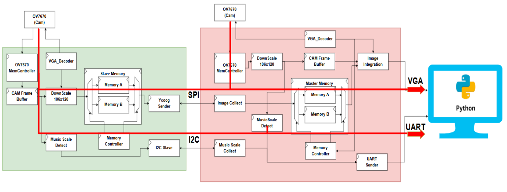
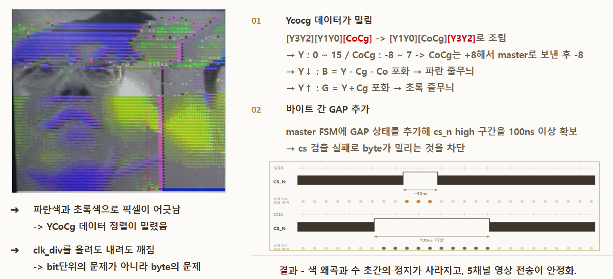
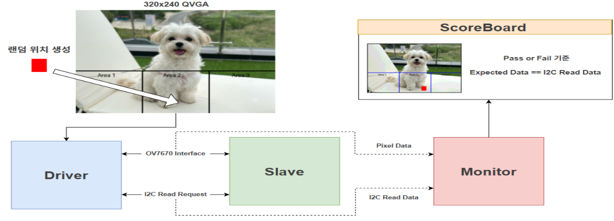
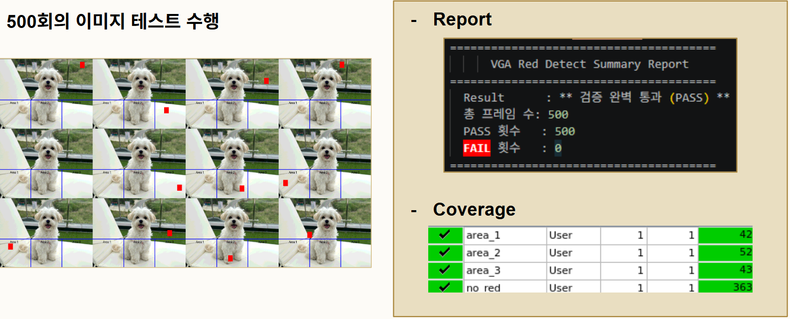
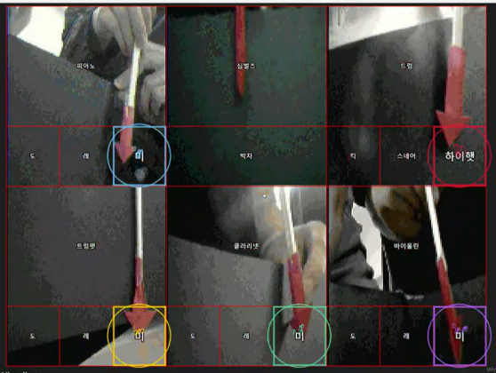

# 🎵 브레멘 음악대 (The Bremen Town Musicians)

> 카메라와 FPGA가 함께 꿈을 이루는 실시간 비전(Vision) 연주 시스템  
> 대한상공회의소 서울기술교육센터 | 2026.07.21

---

## 📌 프로젝트 개요

**브레멘 음악대**는 6대의 OV7670 카메라 영상을 다중 FPGA에서 실시간으로 분산 처리하고, 특정 색상 객체의 위치를 음계 신호로 변환하는 **인터랙티브 비전 오케스트라 시스템**입니다.

1대의 Master FPGA와 5대의 Slave FPGA를 병렬로 연결했으며, 5채널 SPI 통신으로 영상 데이터를 전송하고 I2C 통신으로 각 Slave의 음계 데이터를 수집합니다.

Master FPGA는 수집한 영상을 2×3 VGA 모자이크 화면으로 합성하고, 음계 데이터는 UART를 통해 PC로 전달하여 Python 기반 오디오 UI에서 악기 소리로 출력합니다.

---

## 📅 수행 기간

**2026.07.01 ~ 2026.07.21**

---

## 👥 프로젝트 형태

**6인 팀 프로젝트**

- FPGA Board: Digilent Basys 3 × 6대
- Camera Module: OV7670 × 6대
- Master FPGA: 1대
- Slave FPGA: 5대

---

## 👨‍💻 팀 구성 및 역할

|    이름    | 악기 포지션 | 담당 역할 (Role)                                                       |
| :--------: | :---------: | :--------------------------------------------------------------------- |
| **이준형** |  🪘 Cymbals  | Master Integration, 전체 시스템 아키텍처 및 화면 병합 모듈 설계        |
| **곽은찬** |  🎻 Violin   | Python 실시간 영상/오디오 UI 구현 및 UART 통신 프로토콜 설계           |
| **안정현** | 🎷 Clarinet  | 다중 통신을 위한 I2C Master/Slave 프로토콜 및 FSM 설계                 |
| **윤지원** |   🥁 Drum    | YCoCg 2:1 영상 압축(Encoder) 및 복원(Decoder) 알고리즘 구현            |
| **최여지** |  🎺 Trumpet  | Double Buffering (Ping-Pong) 기반 메모리 컨트롤러 및 동기화 설계       |
| **최은수** |   🎹 Piano   | Slave Integration, OV7670 카메라 제어 및 영역 기반 객체 인식 모듈 구현 |

---

## 🛠 사용 기술

### HDL & Verification

- Verilog HDL
- SystemVerilog
- UVM

### FPGA & Video

- Digilent Basys 3
- Xilinx Artix-7
- OV7670 Camera
- VGA 640×480
- BRAM
- Double Buffering
- Clock Domain Synchronization

### Communication

- SPI 5-Channel
- I2C
- UART
- SCCB

### Software & Tools

- Xilinx Vivado 2020.2
- Python
- OpenCV
- Pygame
- Verdi

---

## ⚙️ 시스템 구성



### Slave FPGA × 5

각 Slave FPGA는 OV7670 카메라 영상을 수집하고 다음 작업을 수행합니다.

1. OV7670 영상 데이터 수집
2. 영상 크기 Downscale
3. YCoCg 기반 영상 압축
4. 빨간색 객체 위치 검출
5. 검출 위치를 2-bit 음계 데이터로 변환
6. 영상 데이터는 SPI, 음계 데이터는 I2C로 Master에 전달

### Master FPGA × 1

Master FPGA는 5대의 Slave FPGA와 자체 카메라에서 데이터를 수집합니다.

1. 5채널 SPI 영상 데이터 수신
2. I2C를 통한 Slave 음계 데이터 수집
3. Ping-Pong Buffer 기반 프레임 저장 및 전환
4. YCoCg 영상 데이터 복원
5. 6개 영상을 2×3 VGA 모자이크 화면으로 합성
6. 12-bit 음계 데이터를 UART Packet으로 변환
7. PC의 Python 오디오 UI로 데이터 전송

### PC Application

PC에서는 UART로 수신한 음계 데이터를 기반으로 각 카메라에 대응하는 악기 소리를 재생합니다.

```text
OV7670 Camera × 6
        ↓
Slave FPGA × 5 ── SPI Video ──────┐
        │                          │
        └──── I2C Scale Data ──────┤
                                   ↓
                             Master FPGA
                                   ↓
                       Ping-Pong Frame Buffer
                                   ↓
                         2×3 VGA Mosaic Output
                                   ↓
                            UART 3-Byte Packet
                                   ↓
                      Python Audio / Visual UI
```

---

## ✨ 주요 구현 내용

### 1. Ping-Pong Double Buffering

한정된 BRAM에서 영상 입력과 출력을 동시에 처리하기 위해 Memory A와 Memory B를 번갈아 사용하는 Ping-Pong Buffer 구조를 적용했습니다.

```text
Camera/SPI Write → Memory A
VGA Read         → Memory B

Frame Complete

Camera/SPI Write → Memory B
VGA Read         → Memory A
```

Write Buffer와 Read Buffer를 분리하여 새로운 프레임이 저장되는 동안 이전 프레임을 안정적으로 출력할 수 있도록 구성했습니다.

### 2. 프레임 전환 및 동기화

카메라 입력과 VGA 출력은 서로 다른 프레임 주기와 클럭 영역에서 동작합니다.

다음 조건을 기준으로 Buffer를 전환하여 화면 깨짐과 데이터 덮어쓰기를 방지했습니다.

- 카메라 프레임 수신 완료
- SPI 영상 데이터 수신 완료
- VGA 프레임 출력 경계 확인
- Master–Slave Handshake 완료
- Write Buffer와 Read Buffer의 충돌 여부 확인

### 3. Master–Slave Handshake

Master와 Slave의 처리 속도 차이로 인한 데이터 손실을 방지하기 위해 상태 기반 Handshake를 적용했습니다.

```text
Master Request  : 0xA9
Slave Ready     : 0x18
Frame Transfer  : Start
Transfer Done   : Buffer Swap
```

Master가 전송을 요청하고 Slave의 준비 상태를 확인한 후 프레임을 전달하도록 구성했습니다.

### 4. YCoCg 영상 압축

SPI 통신의 영상 전송량을 줄이기 위해 RGB 영상을 YCoCg 색 공간으로 변환하고 휘도와 색차 성분을 분리했습니다.

- `Y`: 밝기 정보
- `Co`: Orange 계열 색차 정보
- `Cg`: Green 계열 색차 정보
- 영상 데이터 전송량 감소
- SPI 대역폭 사용량 절감
- Master에서 수신 후 RGB 영상으로 복원

### 5. 영역 기반 음계 검출

카메라 화면 하단을 3개 영역으로 구분하고 빨간색 객체가 검출된 위치를 음계 데이터로 변환했습니다.

```text
Area 1 → 도
Area 2 → 레
Area 3 → 미
```

6대의 카메라는 각각 피아노, 드럼, 트럼펫, 바이올린, 클라리넷, 심벌즈 역할을 담당합니다.

각 카메라의 2-bit 검출 결과를 합쳐 총 12-bit 음계 데이터를 생성합니다.

### 6. I2C 및 UART 통신

- I2C Master가 2ms 주기로 5대의 Slave에 순차 접근
- 각 Slave의 2-bit 음계 데이터 수집
- 수집한 12-bit 데이터를 UART Packet으로 변환
- Python 애플리케이션에서 UART Packet을 수신하여 악기 소리 재생

UART Packet은 다음과 같이 구성했습니다.

```text
Start Header  : 0xFF
PHASE1        : 하위 6-bit
PHASE2        : 상위 6-bit
```

---

## ⚠️ 문제 해결



| 문제 현상 | 원인 분석 | 해결 방법 |
| --- | --- | --- |
| 영상 데이터 색상 왜곡 | SPI 통신 중 YCoCg 데이터 정렬이 바이트 단위로 밀림 | Master FSM에 `GAP` 상태를 추가하고 `CS_n` High 구간을 100ns 이상 확보하여 바이트 정렬 복구 |
| 프레임 출력 중 화면 깨짐 | 같은 메모리에 영상 입력과 VGA 출력이 동시에 접근 | Memory A/B를 분리한 Ping-Pong Buffer를 적용하고 프레임 경계에서 Buffer 전환 |
| Buffer 데이터 덮어쓰기 | Master와 Slave의 처리 속도 차이 | 요청·준비 완료 코드를 사용하는 Handshake 기반 전송 제어 적용 |
| 음계 데이터 누락 | VGA 60Hz와 카메라 약 30fps 사이의 프레임 동기화 불일치 | 래치 기준을 VGA `v_sync`에서 카메라 `vsync`로 변경하고 유효 픽셀 구간에서만 데이터 집계 |

---

## 🧪 검증 내용

### 기능 검증

- OV7670 카메라 초기화 및 영상 출력 확인
- SPI 5채널 영상 데이터 송수신 확인
- I2C Master·Slave 음계 데이터 수집 확인
- UART 3-Byte Packet 전송 확인
- YCoCg 압축 및 복원 결과 확인
- 2×3 VGA 모자이크 영상 출력 확인
- Ping-Pong Buffer의 프레임 단위 전환 확인
- Master–Slave Handshake 동작 확인

### Ping-Pong Buffer 검증

- Write Buffer와 Read Buffer가 서로 다르게 선택되는지 확인
- 프레임 완료 시점에만 Buffer가 변경되는지 확인
- VGA 출력 중 메모리가 덮어써지지 않는지 확인
- 연속 프레임 입력에서 영상 Tearing이 발생하지 않는지 확인

### UVM 검증



특정 영역에서 빨간색 객체가 인식될 때 올바른 I2C 음계 데이터가 출력되는지 검증했습니다.

- Area 1, 2, 3에 대한 랜덤 객체 위치 생성
- 카메라 프레임 기반 입력 Transaction 구성
- 객체 검출 결과와 I2C 출력 데이터 비교
- 총 500회 랜덤 프레임 테스트 수행
- 에러율 0% 달성



```text
Total Tests : 500
Passed      : 500
Failed      : 0
```

---

## 🎥 시연 영상

[](https://youtu.be/a4tfzZNfGx8)

> 이미지를 클릭하면 YouTube에서 시연 영상을 확인할 수 있습니다.

시연에서는 다음 동작을 확인할 수 있습니다.

- 6대의 OV7670 카메라 영상 입력
- 5대 Slave FPGA에서 Master FPGA로 영상 전송
- 2×3 VGA 모자이크 영상 출력
- 빨간색 객체 위치에 따른 음계 검출
- UART 기반 PC 오디오 UI 연동
- 카메라별 악기 소리 실시간 출력

---

## 📂 프로젝트 구조

```text
.
├── Lab00_VGA_OV7670_ctrl/
│   ├── VGA_OV7670_ctrl/
│   │   ├── N04_VGA_OV7670_ctrl.srcs/
│   │   └── N04_VGA_OV7670_ctrl.xpr
│   ├── ov7670_controller.png
│   ├── top_module.png
│   └── readme.md
│
├── Lab01_Breman College of Music/
│   ├── P00_Master/
│   │   ├── SPI_cam_Integration.srcs/
│   │   │   ├── sources_1/
│   │   │   ├── sim_1/
│   │   │   └── constrs_1/
│   │   └── SPI_cam_Integration.xpr
│   │
│   ├── P01_Slave/
│   │   ├── 260713_OV7670_Slave.srcs/
│   │   │   ├── sources_1/
│   │   │   └── constrs_1/
│   │   └── 260713_OV7670_Slave.xpr
│   │
│   └── UVM/
│       ├── Master/
│       ├── Slave/
│       └── Makefile
│
├── images/
│   ├── play.png
│   ├── tb.png
│   ├── top_bd.png
│   ├── uvm_bd.png
│   ├── uvm_report.png
│   └── VGA_teamproj.gif
│
├── 260721_Bremen Musicians_4조_곽은찬,안정현,윤지원,이준형,최여지,최은수.pdf
├── .gitignore
└── README.md
```

> Vivado에서 자동 생성되는 `.cache`, `.gen`, `.runs`, `.sim`, `.hw`, `.Xil` 디렉터리는 프로젝트 구조에서 제외했습니다.

---

## 💡 프로젝트를 통해 배운 점

다중 FPGA 환경에서 영상 데이터를 실시간으로 처리하기 위해서는 개별 모듈의 기능뿐 아니라 프레임 단위 동기화와 메모리 접근 순서가 중요하다는 점을 이해했습니다.

프로젝트를 통해 다음 내용을 경험했습니다.

- 다중 FPGA 기반 영상 처리 시스템 구성
- 프레임 단위 메모리 관리
- Ping-Pong Buffer 기반 동시 Read·Write 처리
- Clock Domain 간 데이터 동기화
- SPI·I2C·UART 통신 모듈 통합
- Handshake 기반 Master–Slave 제어
- 영상 압축 및 VGA 모자이크 출력
- UVM 기반 객체 인식 및 음계 데이터 검증
- 팀 단위 모듈 설계와 시스템 통합

---

## 📄 발표 자료

전체 시스템 설계와 검증 과정은 아래 발표 자료에서 확인할 수 있습니다.

[📑 프로젝트 발표 자료 보기](<./260721_Bremen Musicians_4조_곽은찬,안정현,윤지원,이준형,최여지,최은수.pdf>)

---

## 📜 Acknowledgments

- 악기 음원 소스: 미국 아이오와 대학교 전자음악 스튜디오 오픈소스 악기 음향 데이터베이스 활용
- 본 프로젝트는 6인 팀 프로젝트로 수행되었습니다.
